# Disclaimer

- This repo is based on the Udemy course complete guide to building an app with net core and react (https://bah.udemy.com/course/complete-guide-to-building-an-app-with-net-core-and-react/learn/lecture/24835518#overview)

- The repo follows the course using for React state management MobX and for Theming Semantic-UI.
- The API has minimal feature to support the implementation of
  - client-app
  - -client-app-redux

## How to run the application

- cd in your root folder where you want to call git clone. In my case is

```console
cd PS [C:\Dev\Repos\sandbox\]
```

- clone the project

```console
git clone https://github.boozallencsn.com/RCRP/eras-react-api-demo
```

- Start the API
  - Open new terminal
  - From the root folder execute: (root folder is intended to be the folder where you run your git clone)

```shell
cd API
```

```shell
dotnet watch
```
TODO Localhost
- Start Client UI MboX from root folder
  - Open new terminal

```shell
cd client-app
```

```shell
npm i
```

```shell
npm run start
```

- Start Client UI Redux from root folder
  - Open new terminal


```shell
cd client-app-redux
```

```shell
npm i
```

```shell
npm run start
```


# .NET 8 REST API With React

## Definitions

### Architecture - <https://handsonreact.com/docs/architecture>

- It's valuable to understand how JavaScript applications are architected. In particular, it's valuable to understand how JavaScript application architecture is different from other web frameworks.

#### Where to Render

- It's useful to think about where the HTML and data come together or where the contents of a web page are rendered. There are three places to render:
  - **Server-side Rendering (SSR)**
    - on the web server in the chosen server-side programming language the most common servers-side programming languages are Java, C#, Python, Ruby, and PHP but it could be JavaScript running on a JavaScript runtime environment (for example: Node.js)
  - **Client-side Rendering (CSR)**
    - in the end user's web browser using a client-side programming language the most common client-side programming language is JavaScript Web Assembly has made it possible to use other languages in the browser
  - **Static Site Generation (SSG)**
    - on the developer machine or continuous build server at build time the most common languages are JavaScript (Next.js, Gatsby, Docusaurus, Nuxt, Astro), Go (Hugo), and Ruby (Jekyll) this is sometimes referred to as a Jamstack architecture here is a list of common SSGs

#### Where to render ERAS

- ERAS is going to be a Single-page web application architecture (CSR)
- 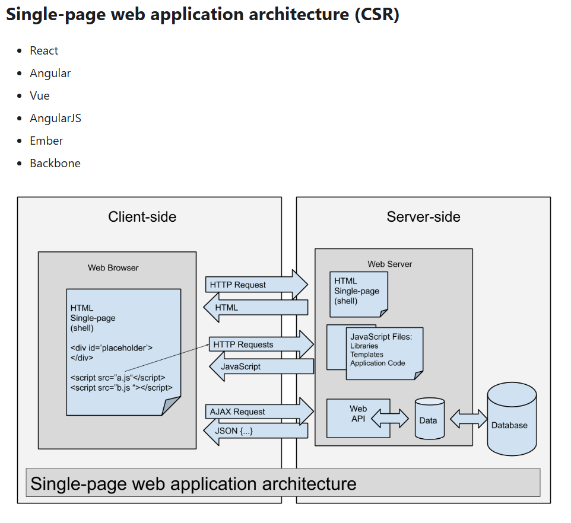

### React Architecture - <https://handsonreact.com/docs/architecture>

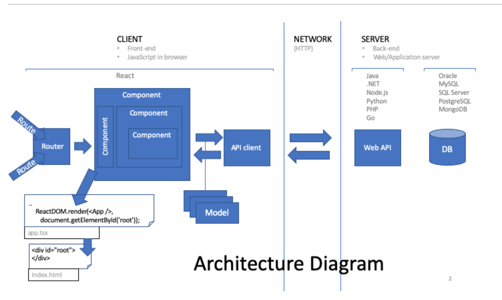

### State Management in React

- What is State Management in React?
  - State management refers to the methods and techniques used to handle, organize, and share data within a React application. It involves the systematic management and manipulation of data, ensuring seamless integration and synchronization across various components.

- Benefits of React State Management
  - State management plays a pivotal role in developing dynamic and interactive applications that need to handle evolving data. This data can come from user interactions or other triggering events.

By implementing robust state management techniques, React applications can maintain data integrity, enhance performance, and provide a smooth user experience.

#### Props vs the Context API

- <https://www.freecodecamp.org/news/state-management-in-react-props-vs-context-api/>

### Redux Architecture

- <https://handsonreact.com/docs/redux>
- 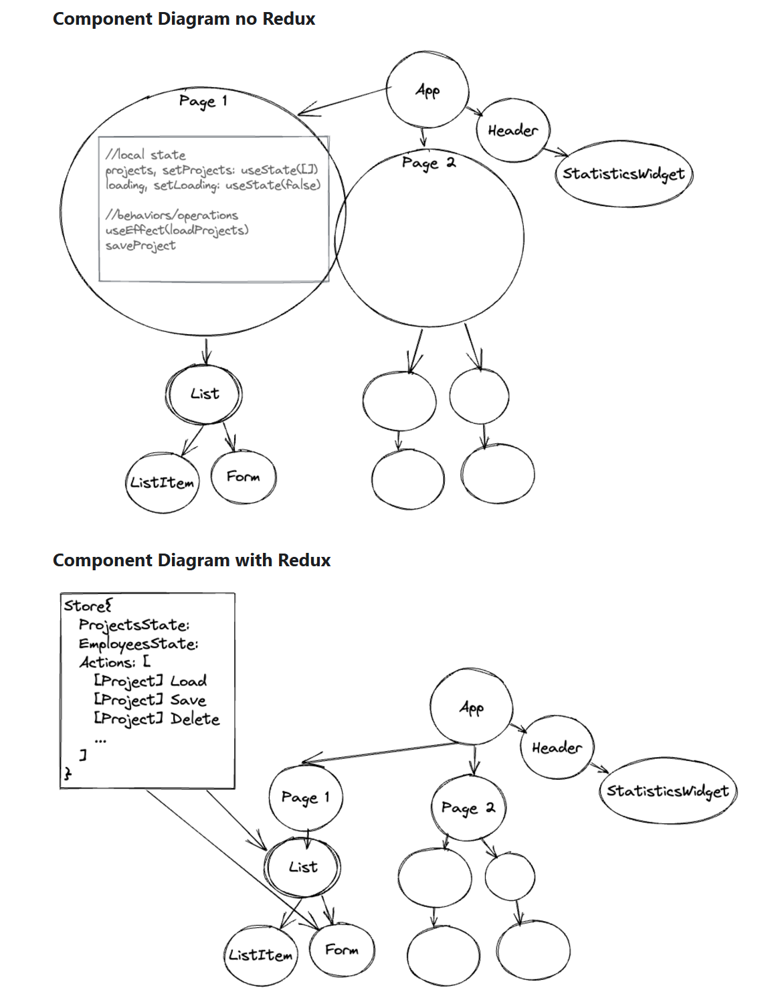
  
#### React Virtual DOM

- <https://github.com/eggheadio/illustrated-dev/blob/master/content/explainers/react-vdom/index.mdx>

## Computer Setup for react

- <https://handsonreact.com/docs/computer-setup>

## Visual Studio Code Setup for react

- <https://handsonreact.com/docs/visual-studio-code-setup>
- Recommended Extensions
  - 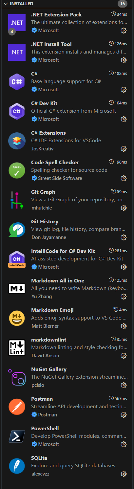

## dotnet command line


```
dotnet info
```

- global json for multiple profile .NET SDKs installed:

```
dotnet new list
```

copy and paste in terminal content of

Explain 
- launchSettings.json change port
- program.cs
  -  services/configuration
  -  build
  -  middleware
  - run

## roots and endpoint

- run app
  - Listening
  - swagger
- Postman endpoint

# Section 2

- Note all the Activities come form the Udemy course <https://bah.udemy.com/course/complete-guide-to-building-an-app-with-net-core-and-react/>

## Create Domain Entity (Using Code First)

- Add class for Entity (Model) 
  - Id
  - properties public with setters and getters
  - class relates to a table
- ORM Sqlite to prototype or use SQL server sam
  - Add package Persistence layer
    - Microsoft.EntityFrameworkCore.Sqlite
  - Add class DataContext inherit from DbContext 
    - ?hove over to show patterns
    - ?Quick Fix for constructor
      - 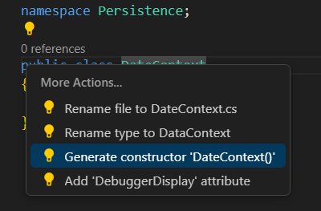
    - Specify DBSet to match your table
  
### Adding an Entity Framework DbContext to API 

- Run from root folder restore packages

```
dotnet restore
```

- Add DbContext to program.cs
- Add connection string to appsettings

## Creating Migration

- need tool `dotnet-ef`
- check which tools are already installed

```
dotnet tool list -g
```

- go to <https://www.nuget.org/packages/dotnet-ef/> to get the command to install the tool
- install dotnet-ef
- validate installation

```
dotnet-ef
```

- 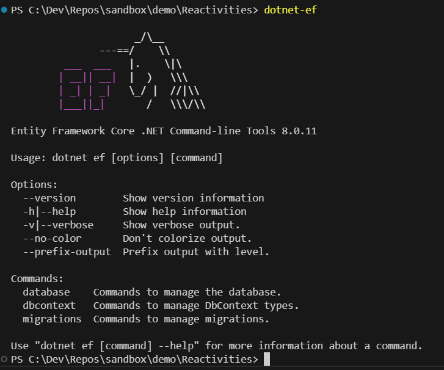
- Initialize migration 
- (note will error out because we did not installed Microsoft.EntityFrameworkCore.Design yet)
- Install package Microsoft.EntityFrameworkCore.Design in api and re-run migration
- 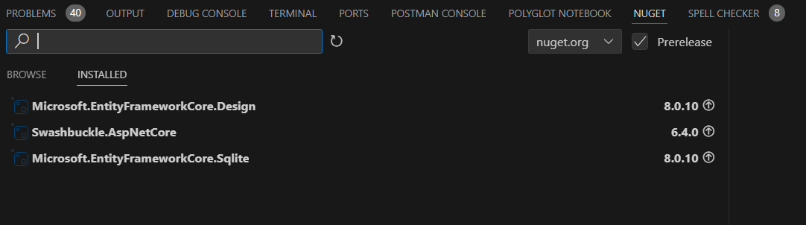

```bash
dotnet ef migrations add InitialCreate -s API -p Persistence 
```

```console
PS C:\Dev\Repos\sandbox\demo\Reactivities> dotnet ef migrations add InitialCreate -s API -p Persistence 
Build started...
Build succeeded.
Done. To undo this action, use 'ef migrations remove'
```


- check migration folder which files have been created
  - Convention on Id otherwise you need to specify with [key]
  - note all nullable (Validation will be created later)
- run

```bash
cd API 
```

- create scope and call migration on start of the API
  - Show program.cs section
- start application

```bash
dotnet watch 
```


- examine console
- open sqlite with vs extension 
  - 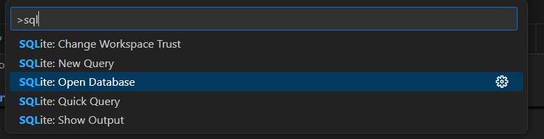
  - 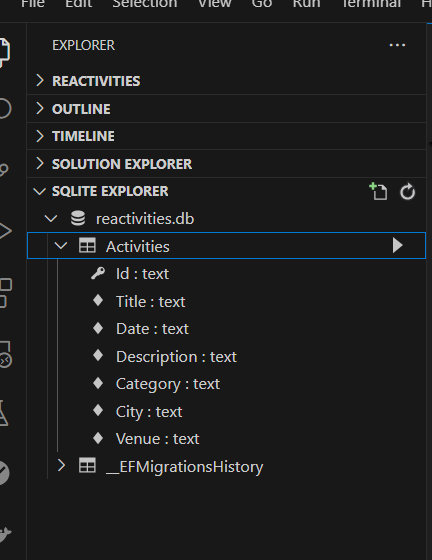

### Seeding

- Create Seed.cs from snip
- explain seeding
- add to program.cs
- restart app to seed the db

```bash
dotnet watch 
```

### Adding API controller and Base controller

#### what is an API https://github.com/eggheadio/illustrated-dev/blob/master/content/explainers/api/index.mdx

- Show weather controller
  - Note that is using a base controller
- Create base controller
- Create the ActivityController which derives from base controller
- Inject the DataContext  in activity controller
- Create GetActivities() and GetActivity(id) endpoints
- Start API
- Test endpoints from Postman

# Section 3

## React Vite

- <https://vite.dev/guide/#scaffolding-your-first-vite-project>
  - Need to install Node
    - <https://nodejs.org/en/download/prebuilt-installer>
  - validate that nodejs is installed
- Open a new terminal and run

```console
node -v
```
- create react application using vite
  
```console
npm create vite@latest
```

- Give it a name (using 'ui-client-app)
- Select React
  - 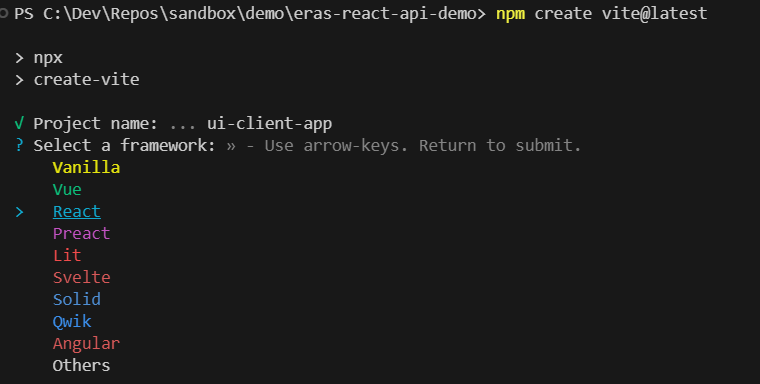
- Select Typescript + SWC (which stands for Speedy Web Compiler)
  - 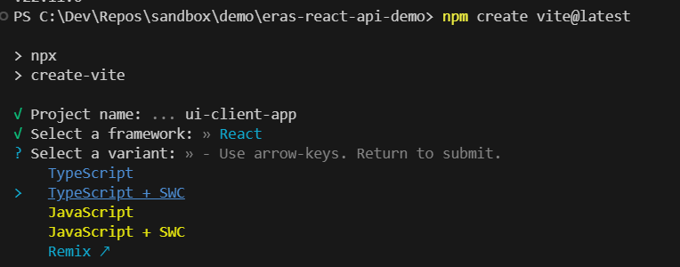
  - 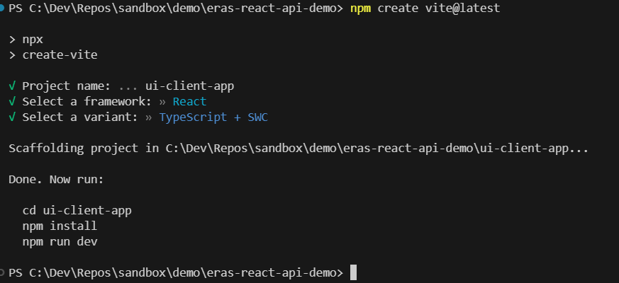
- follow the instructions in the prompt

```console

Done. Now run:

  cd ui-client-app
  npm install
  npm run dev
```


# Section 12 Identity

- Install and configure ASP.Net Core identity. We've taken a look at JWT token authentication, which is the method we're using to allow users to authenticate to our API, a very commonly used method of authenticating to an API because we don't have a session with our API when we're making requests to API endpoints.As soon as we've received the data back from the API, our client is effectively disconnected from ourAPI. So we can't remember the user login state.When we're using an API, we have to use something like a JWT so that we can send that token with every request to the API and that's how we maintain our login status with our API. So we've added login and register methods to allow users to sign up and log in and we've added authentication to our endpoints. So other than the API account controller, everything in our application now requires authenticated requests to retrieve the data. One of the security concerns might be the length of time that our token is valid for seven days. This is insecure. Well, our token at the moment is valid for seven days, and in fact we're not even checking the token expiry as a token validation parameter. So effectively our token could be said to be valid forever. Our server isn't going to check the expiry to see if the token is still valid at this point. And this is something that we address later on. We're going to take a look at refresh tokens so we can reduce the amount of time our token lives for and we can reduce it to say, ten minutes or something. And as that time expires, then we can refresh the token, so long as our user is still using our application. It's just the steps you take to make it as difficult as possible. There are levels of security you can go to and we will look at securing our application better than we're doing it right now. We're not publishing our application right now. We're still working on it. In production we don't use Http. We use Https, which is a requirement if you're asking users for usernames and passwords because they are also sent in clear text at the moment as well. So the header and the payload are weaknesses. If we do not use SSL to protect our network requests, but in production we do use that, which means the headers and the payload are encrypted and SSL is a secure and mature technology to protect network traffic from going to the client to the server. 

## Add IdentityDbContext

- Once you add the inheritance from IdentityDbContext<AppUser>  you need to create a new migration 
- to do so:
- Stop API
- Go to root folder

- if in PS C:\Dev\Repos\sandbox\Reactivities\API> cd ..

```bash
cd ..
```

- Create new migration

```bash
dotnet ef migrations add IdentityAdded -p Persistence -s API
```

## Reset from scratch DB and migrations

```bash
dotnet ef database update 0 [ --context DataContext ] -s API -p Persistence
```
remove table from db DotnetStarter].[dbo].[__EFMigrationsHistory]
remove files in folder migration

```bash
dotnet ef migrations add Initialize -s API -p Persistence 
```

```bash
dotnet ef database update -s API -p Persistence 
```

- result
- 

```bash
cd api
```

```bash
dotnet watch
```

# Section 14

Dotnet cmd lines

## Configure relationship

dotnet ef migrations add ActivityAttendee -p Persistence -s API

## Add Infrastructure project

Create a new project library

dotnet new classlib -n Infrastructure

reference the project to the solution 

dotnet sln add Infrastructure

Add reference of Application to Infrastructure

cd Infrastructure
dotnet add reference ../Application
cd ..

reference API to  Infrastructure 

cd api
dotnet add reference ../Infrastructure
Now we're going to want to access the service from inside our application project, but our application
project does not have a dependency on the infrastructure project.
So in order to use the service that we're going to create inside our infrastructure projects, we're
going to need an interface in our application project to do so.
So we're going to create a new folder and we're going to call this one interfaces.
And inside this folder we're going to create a new 


Eagerly Loading
Lazy Loading
Explicitly Loading

Projection...


Drop db
dotnet ef database drop -p Persistence -s API